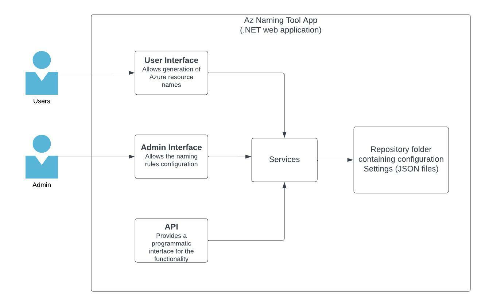
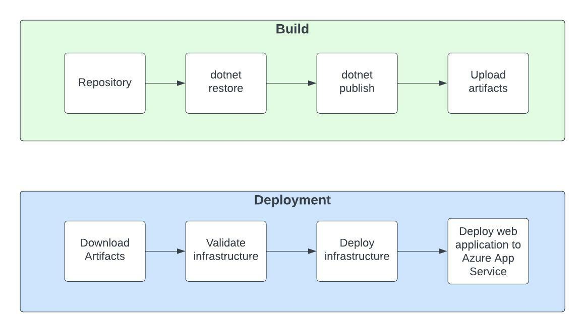

# AzNamingTool

The Naming Tool was developed using a naming pattern based on Microsoft's best practices. Once the organizational components have been defined by an administrator, users can use the tool to generate a name for the desired Azure resource.

The Naming Tool can be accessed at: [https://app-gov-az-naming-tool-dev-eastus2.azurewebsites.net](https://app-gov-az-naming-tool-dev-eastus2.azurewebsites.net)

## Application Architecture

## Local development

The recommended way to deploy the Azure Naming tool locally is using Docker. The project contains Docker support. Follow the instructions at [Run as a Docker image](https://github.com/microsoft/CloudAdoptionFramework/blob/master/ready/AzNamingTool/INSTALLATION.md#run-as-a-docker-image) to have the tool deployed locally.

## Build and deployment

Azure Naming Tool supports several [deployment options](https://github.com/microsoft/CloudAdoptionFramework/blob/master/ready/AzNamingTool/INSTALLATION.md#choosing-an-installation-option), at FBITN the tool is deployed as an Azure Web App using GitHub action workflows.

## Guide to Setup AzNamingTool

- [Guide to setup AzNamingTool](https://github.com/microsoft/CloudAdoptionFramework/blob/master/ready/AzNamingTool/INSTALLATION.md)

## Tools And Technologies

The application is built with following tools and technologies -

- Source Control - [Github](https://github.com/)
- AzNamingTool - [AzNamingTool](https://github.com/microsoft/CloudAdoptionFramework/tree/master/ready/AzNamingTool#overview)
- Development IDE - [Visual Studio Code](https://code.visualstudio.com/)

## Project Components

- UI/Admin
- API
- JSON configuration files
- Dockerfile

## References

- [Official Microsoft AzNamingTool Repo](https://github.com/microsoft/CloudAdoptionFramework/tree/master/ready/AzNamingTool#overview)
